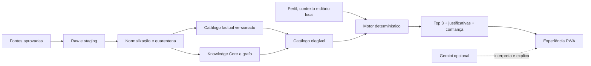

<div align="center">

# O Antiquário

### O perfume certo para este momento.

Companion olfativo local-first que cruza gosto pessoal, contexto, clima, ambiente e evidências rastreáveis para recomendar fragrâncias e explicar cada escolha.

[](#estado-atual)
[](#como-funciona)
[](#executar-localmente)
[](#tecnologias)
[](#pipeline-de-dados)

[Visão do produto](docs/ESCOPO.md) · [Roadmap técnico](docs/ROADMAP.md) · [Roadmap B2C/B2B](docs/ROADMAP_B2C_B2B.md) · [Direção visual](docs/DIRECAO_VISUAL.md)

</div>

---

## Visão

Escolher um perfume raramente é apenas escolher notas. A experiência muda com temperatura, umidade, ventilação, ocasião, intensidade desejada, memória e pele.

O Antiquário está sendo construído para responder perguntas como:

- “O que funciona em um escritório fechado num dia quente?”
- “Quero algo elegante para a noite, mas sem dominar o ambiente.”
- “Qual perfume da minha coleção combina com este momento?”
- “Por que esta opção foi recomendada e o que pode não funcionar para mim?”
- “Como meu gosto mudou depois dos últimos usos?”

O objetivo não é produzir um ranking genérico. É criar uma consulta privada, explicável e progressivamente pessoal — da perfumaria acessível à alta perfumaria, incluindo casas brasileiras, árabes, designer e nicho.

## O que torna o projeto diferente

| Pilar | Como aparece no Antiquário |
|---|---|
| Recomendação contextual | Combina preferências, clima, ambiente, ocasião, desempenho desejado e orçamento. |
| Motor explicável | Filtros e pontuação são determinísticos; cada recomendação preserva forças, ressalvas e confiança. |
| Conhecimento rastreável | Fatos, curadoria, estimativas e memória pessoal vivem em camadas diferentes. |
| Memória olfativa | A visão futura aprende com abertura, coração, dry-down, duração e adequação percebidos na pele. |
| Privacidade | Perfil e diário são locais por padrão; a aplicação continua útil sem nuvem. |
| IA sob controle | A IA poderá interpretar e narrar candidatos já escolhidos, mas não inventar perfumes ou alterar fatos. |
| Experiência editorial | Interface vinho e champagne, transparências, névoa, aurora e movimento sutil inspirados na presença invisível de uma fragrância. |

## Estado atual

> [!IMPORTANT]
> O Antiquário está em **alpha local**. A base e o recomendador já são executáveis, mas o produto ainda não representa uma consultoria comercial concluída. Afirmações sensoriais e campos de baixa confiança permanecem sujeitos aos gates editoriais e de segurança.

Snapshot incluído no repositório:

| Camada | Estado |
|---|---|
| PWA React/Vite | Interface local funcional, responsiva e conectada ao recomendador. |
| Consulta | Jornada em três etapas com atualização reativa das recomendações. |
| Catálogo factual | 282 fragrâncias, 276 descritores olfativos e 251 claims semânticos na release atual. |
| Catálogo de recomendação | 249 registros passam pelo gate técnico mínimo atual. |
| Knowledge Core | 850 documentos, 780 chunks e 2.226 relações tipadas compiladas. |
| Pipeline | Wikidata, PDFs textuais oficiais, staging, quarentena, DuckDB, Parquet e releases versionadas. |
| Companion Gemini | Camada conversacional para o usuário ainda não integrada; o produto funciona sem ela. |
| Produto B2C/B2B | Estratégia documentada; execução condicionada ao Gate de Confiança Olfativa. |

O gate técnico de quantidade do catálogo não equivale ao gate comercial. Antes de experiências B2C ou B2B, o projeto ainda precisa comprovar recuperação segura, coerência sensorial, isolamento de memória e validação com uso real.

## Como funciona



1. Fontes passam por manifesto, extração e validação de proveniência.
2. Identidades ou termos ambíguos ficam em quarentena.
3. Somente conhecimento aprovado entra no grafo e nos artefatos recuperáveis.
4. O recomendador aplica exclusões antes de calcular a pontuação.
5. O top 3 preserva os fatores que realmente justificaram cada escolha.
6. Templates locais mantêm a experiência funcional sem Gemini ou internet.

## Executar localmente

### Pré-requisitos

- Node.js 24 ou superior;
- npm;
- Python 3.12 ou superior apenas para trabalhar no pipeline de dados.

### Interface

```bash
npm install
npm run dev
```

Abra [http://127.0.0.1:5173/](http://127.0.0.1:5173/).

A PWA usa os artefatos versionados presentes em `apps/web/public/catalog`. Nenhuma chave de IA é necessária para executar a interface atual.

### Verificação completa

```bash
npm run typecheck
npm test
npm run data:test
npm run build
```

Outros comandos úteis:

```bash
npm run demo
npm run knowledge:validate
npm run knowledge:build
npm run recommendation:build
npm run catalog:compile
```

## Pipeline de dados

O pipeline é uma ferramenta interna de manutenção. O usuário final recebe releases prontas e nunca precisa importar, organizar ou revisar arquivos.

### Preparar o ambiente Python no Windows

```powershell
python -m venv .venv
.\.venv\Scripts\python.exe -m pip install -c requirements-data.lock -e .
```

### Fluxos principais

```powershell
npm run data:status
npm run data:demo
npm run data:sync:wikidata
npm run data:sync:odeuropa
npm run data:resolve:odeuropa
npm run data:index:odeuropa
npm run data:backlog:odeuropa
npm run data:plan:odeuropa-enrichment
npm run data:gate:odeuropa-demand
npm run data:build
npm run catalog:compile
```

Para um catálogo oficial com camada textual:

```powershell
npm run data:ingest:official-pdf -- `
  --input "data/raw/official-catalogs/<marca>/<catalogo>.pdf" `
  --brand <marca> `
  --edition <edicao> `
  --source-id <source_id> `
  --no-inbox
```

O extrator textual reconhece tipos reais de fragrância, separa produtos corporais e acessórios, deduplica repetições e preserva página, hash, método e confiança. OCR permanece fora do fluxo atual.

O importador ODEUROPA baixa um commit fixado da taxonomia multilíngue, verifica hashes e gera somente candidatos em `data/staging/odeuropa`. Termos sem categoria e colisões normalizadas ficam em quarentena; essa trilha não cria notas nem pirâmides de perfumes. A fonte exige a atribuição “ODEUROPA multilingualTaxonomies — Menini et al. (2022), CC BY 4.0”.

O resolvedor ODEUROPA cruza o staging com a taxonomia canônica sem confundir descritores com notas. Correspondências inglesas exatas e únicas viram pontes de busca; aliases e synsets geram candidatos; homógrafos e destinos múltiplos permanecem ambíguos. Todas as saídas têm escopo `retrieval_only`, identidade semântica não verificada e promoção bloqueada.

O índice de recuperação compila somente as pontes resolvidas, projeta rótulos canônicos em português e inglês, exige o idioma da consulta e aponta para chunks reais quando o conceito já possui conteúdo no Knowledge Core. Um conjunto ouro testa precisão, revocação, limites de palavra, bloqueio de candidatos e ausência de rotas perigosas.

O backlog de roteamento cruza as lacunas com o conjunto ouro, o catálogo ativo e as conexões estruturais do grafo. Ele separa resolução de identidade de cobertura editorial, prioriza o que já afeta consultas ou perfumes reais e nunca cria documentos, fatos ou relações automaticamente.

A automação de enriquecimento transforma documentos rasos `P3` em candidatos factuais. Ela reutiliza apenas relações de pirâmide já aprovadas, gera uma prévia, executa auditoria e exige que o hash do arquivo continue igual antes da promoção. Não cria relações, descrições sensoriais ou claims de desempenho.

O gate `P4` ordena o que merece pesquisa usando três sinais independentes: consultas recorrentes anonimizadas, presença em novos catálogos já aprovados e prioridade editorial justificada. O texto da consulta é processado em memória e descartado; o log privado guarda apenas a data, o idioma e os IDs canônicos encontrados. A demanda autoriza pesquisa, mas nunca cria documentos, fatos, notas ou relações no Knowledge Core.

## Conhecimento, RAG e memória

O vault editorial compatível com Obsidian vive em `knowledge/vault`.

```text
Markdown + frontmatter
  → validação de fontes
  → resolução de relações e wikilinks
  → chunking semântico
  → grafo e relatório de saúde
  → índice recuperável versionado
```

Princípios do Knowledge Core:

- `00_Inbox` não entra no RAG;
- somente documentos aprovados são compilados;
- IDs duplicados, relações inválidas e links quebrados bloqueiam o build;
- cada evidência permanece ligada ao claim que sustenta;
- conteúdo recuperado não pode redefinir as regras do sistema;
- memória pessoal nunca se torna consenso coletivo automaticamente.

Leia [Knowledge Core e memória RAG](docs/CONHECIMENTO_RAG.md) e [Curadoria Editorial](docs/CURADORIA_EDITORIAL.md).

## Estrutura do repositório

```text
apps/web/                 PWA React/Vite
src/recommender/          filtros, score, diversidade e explicações
src/catalog/              compiladores dos catálogos web e de recomendação
src/knowledge/            validação, grafo, chunks e health gates
src/taxonomy/             vocabulário e normalização olfativa
pipeline/                 ingestão e transformação em Python
data/                     fontes, staging, auditorias e releases
knowledge/vault/          Knowledge Core compatível com Obsidian
knowledge/compiled/       artefatos determinísticos do RAG
docs/                     decisões, escopo e roadmaps
```

## Tecnologias

- React 19 e Vite 8;
- TypeScript em modo estrito;
- Zod para contratos de domínio;
- Node Test Runner;
- Python 3.12;
- DuckDB e Parquet;
- PyYAML, pypdf e pdfplumber;
- Markdown, YAML e Obsidian para curadoria;
- Gemini Flash planejado como camada conversacional opcional.

## Princípios de confiança

- O motor local escolhe; a IA apenas interpreta e explica.
- Um dado factual nunca nasce de uma resposta conversacional.
- Pirâmide olfativa só é registrada por camada quando a fonte declara a camada.
- Experiência na pele é pessoal e não sobrescreve silenciosamente dados agregados.
- Ranking e monetização terão separação técnica.
- Nenhum cookie de terceiros, sessão autenticada ou bypass anti-bot faz parte do projeto.
- PDFs brutos, credenciais, `.env` e memória privada não entram no Git.
- Cada fonte mantém origem, licença, data, método e nível de confiança.

## Caminho do produto

### Fundação atual

Consolidar catálogo, taxonomia, grafo, RAG, conjunto ouro, privacidade e o Gate de Confiança Olfativa.

### B2C

Beta sensorial fechado → Antiquário Essencial → Passaporte Olfativo → Privé → comércio assistido → comunidade moderada.

### B2B

Descoberta com consultores → catálogo multi-tenant → Antiquário Pro → piloto pago → Antiquário Maison → inteligência comercial agregada.

Os critérios, métricas e limites de cada fase estão no [Roadmap de produto B2C e B2B](docs/ROADMAP_B2C_B2B.md).

## Documentação

- [`docs/ROADMAP_VALIDACAO_FRONTEND.md`](docs/ROADMAP_VALIDACAO_FRONTEND.md): próxima rota para simplificar a consulta e entregar respostas concretas com perfumes reais.

| Documento | Conteúdo |
|---|---|
| [ESCOPO.md](docs/ESCOPO.md) | visão, público, funcionalidades e requisitos do produto |
| [ROADMAP.md](docs/ROADMAP.md) | estado técnico e sequência de continuidade |
| [ROADMAP_B2C_B2B.md](docs/ROADMAP_B2C_B2B.md) | gates e evolução comercial das duas trilhas |
| [IMPLEMENTACAO.md](docs/IMPLEMENTACAO.md) | arquitetura, contratos, segurança e deploy |
| [DIRECAO_VISUAL.md](docs/DIRECAO_VISUAL.md) | linguagem visual vinho, champagne e aurora |
| [CONHECIMENTO_RAG.md](docs/CONHECIMENTO_RAG.md) | Knowledge Core, grafo e memória recuperável |
| [PLATAFORMA_DADOS.md](docs/PLATAFORMA_DADOS.md) | pipeline, releases e auditorias |
| [FONTES_E_LICENCAS.md](docs/FONTES_E_LICENCAS.md) | classificação e isolamento de fontes |
| [TAXONOMIA.md](docs/TAXONOMIA.md) | notas, acordes, aliases e normalização |
| [CATALOGO_WEB.md](docs/CATALOGO_WEB.md) | artefatos publicados para a PWA |
| [CURADORIA_EDITORIAL.md](docs/CURADORIA_EDITORIAL.md) | promoção segura de conhecimento ao core |

## Colaboração

O projeto está em construção ativa. Antes de propor uma nova fonte ou alterar o modelo olfativo:

1. leia os documentos de fontes, taxonomia e curadoria;
2. preserve a separação entre fato, curadoria, estimativa e memória pessoal;
3. não adicione PDFs, credenciais, cookies ou conteúdo privado ao repositório;
4. inclua proveniência e testes para qualquer transformação de dados;
5. execute os quatro comandos de verificação antes de abrir uma contribuição.

---

<div align="center">

**O Antiquário** — tecnologia para compreender fragrâncias sem reduzir perfume a uma lista de notas.

</div>
