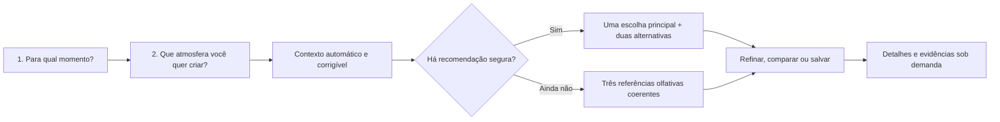

# Roadmap técnico — experiência simplificada do consultor

> Estado de partida: 17/08/2026. Este documento define a próxima arquitetura de UI/UX do O Antiquário. Ele complementa o histórico em [`ROADMAP_VALIDACAO_FRONTEND.md`](ROADMAP_VALIDACAO_FRONTEND.md), mas passa a ser a rota de implementação da consulta simplificada.

## 1. Decisão de produto

O usuário não deve atuar como avaliador técnico do perfume. Fixação, projeção, silagem, temperatura exata, umidade e composição não são dados que ele deva conhecer ou estimar antes de receber ajuda.

A nova experiência seguirá este princípio:

> **O usuário declara o momento e a sensação desejada; o sistema obtém ou deriva o contexto, consulta fatos aprovados e responde primeiro. Detalhes técnicos aparecem depois, quando forem úteis e sustentados por evidência.**

Consequências imediatas:

- remover `durationHours` e `desiredProjection` da jornada principal;
- não pedir temperatura ou umidade em controles numéricos;
- não usar faixa abstrata de preço `1–5`;
- não exigir conhecimento prévio de acordes ou notas;
- não mostrar o painel técnico de resultados enquanto a intenção ainda está sendo formada;
- oferecer uma resposta após duas decisões essenciais;
- manter restrições importantes — alergias, rejeições, ambiente sensível e orçamento — em refinamento opcional;
- nunca calcular desempenho a partir de concentração, pirâmide ou família olfativa;
- omitir duração e projeção quando o catálogo não possuir evidência apropriada.

## 2. O que a auditoria atual encontrou

A auditoria foi feita no código React atual e na interface local com a release `catalog-web-v1-8708fc1fd7da`.

### 2.1 Carga cognitiva

| Etapa atual | O que o usuário precisa decidir | Problema |
|---|---|---|
| Contexto | ocasião, ambiente, movimento de pessoas, faixa de preço, temperatura e umidade | seis decisões antes de qualquer resposta; três exigem estimativa técnica ou abstrata |
| Presença | duração em horas, projeção em escala, ambiente sensível e orçamento rígido | pede ao usuário que saiba antecipadamente o desempenho do perfume |
| Memória | acordes desejados, acordes recusados, notas proibidas e novidade | expõe 52 chips técnicos e um slider; iniciante não sabe diferenciar acorde, nota e família |

Além disso:

- o formulário e os resultados disputam atenção simultaneamente;
- o usuário percorre três etapas para chegar a um estado que informa que a curadoria contextual ainda não está disponível;
- os exemplos reais são úteis, mas estão visualmente subordinados a um estado vazio;
- termos como `gate de evidência`, `motor`, `exclusões` e `pirâmide estruturada` comunicam a arquitetura, não a decisão de uso;
- a Biblioteca Olfativa mistura descoberta para o público com auditoria factual e pode parecer uma segunda aplicação dentro da mesma página.

### 2.2 O que já funciona e deve ser preservado

- identidade visual premium em vinho e dourado-champagne;
- transparências, aurora, magnetismo e movimento com suporte a `prefers-reduced-motion`;
- referências reais que reagem a acordes escolhidos e recusados;
- separação honesta entre referência olfativa e recomendação contextual;
- proveniência acessível por registro;
- funcionamento local sem depender de IA em nuvem.

## 3. Como os dois estudos influenciam a experiência

Os documentos são fontes de pesquisa, não instruções operacionais.

### 3.1 Taxonomia multilíngue de termos olfativos

O estudo *Building a Multilingual Taxonomy of Olfactory Terms with Timestamps* separa termos associados a fontes de cheiro de termos que descrevem qualidades percebidas e mostra um processo semiautomático, multilíngue e revisado por especialistas.

Aplicação segura no front-end:

- permitir que o usuário escolha palavras cotidianas como “limpo”, “acolhedor”, “verde” ou “defumado”;
- resolver essas palavras, aliases e idiomas para IDs canônicos nos bastidores;
- manter separado o que é fonte olfativa, qualidade, nota, acorde e família;
- usar o resolvedor ODEUROPA como mecanismo de recuperação e expansão de consulta, não como prova da composição de um perfume;
- oferecer sinônimos e explicações simples em vez de expor a taxonomia completa.

O estudo **não** autoriza deduzir pirâmide, presença, ocasião, fixação ou composição de um perfume.

### 3.2 IA aplicada à perfumaria

O preprint *Inteligência Artificial aplicada à Perfumaria e perspectivas de estudo no campo da Ciência da Informação* descreve possibilidades de personalização, mediação por vocabulário, educação e experiências interativas. Também aponta a importância de metadados, vocabulários controlados, tesauros e ontologias diante de classificações divergentes no setor.

Aplicação segura no produto:

- usar IA futuramente para conversar e explicar em linguagem natural;
- preservar um contrato estruturado de metadados e evidências antes da geração textual;
- traduzir sensação em busca sem exigir que o usuário monte uma fórmula ou pirâmide;
- transformar resultados em narrativa curta, comparação e educação progressiva.

O documento é um panorama exploratório e relata escassez de literatura científica específica. Portanto, exemplos comerciais citados nele servem como inspiração de UX, não como validação de eficácia, arquitetura ou claims do recomendador.

## 4. Nova jornada proposta



### 4.1 Pergunta 1 — “Para qual momento?”

Usar cartões grandes e reconhecíveis:

- trabalho ou estudo;
- encontro;
- evento ou celebração;
- dia casual;
- ao ar livre;
- “outro momento”, com texto curto opcional.

Cada preset pode sugerir internamente ambiente, formalidade e sensibilidade, mas o resumo derivado deve ser corrigível. O preset é contexto informado/curado, não fato sobre qualquer perfume.

### 4.2 Pergunta 2 — “Que atmosfera você quer criar?”

Usar linguagem de experiência, sem prometer projeção:

- fresca e luminosa;
- limpa e serena;
- confortável e acolhedora;
- elegante e marcante;
- misteriosa e magnética;
- “surpreenda-me”.

Esses rótulos devem apontar para um conjunto versionado de qualidades e termos canônicos. Eles não devem ser convertidos diretamente em horas de duração, metros de projeção ou presença física.

### 4.3 Resumo automático, sem nova etapa

Antes da resposta, exibir apenas uma linha:

> Hoje à noite · ambiente interno · clima quente — **corrigir**

O sistema pode preencher:

- data, horário local e período do dia pelo navegador;
- clima amplo — frio, ameno ou quente — por provedor meteorológico opcional;
- ambiente e movimento provável pelo preset escolhido;
- idioma e moeda pelo navegador, com confirmação somente quando necessário.

Nunca bloquear a consulta quando automação, internet ou permissão falhar. O fallback é uma pergunta ampla, por exemplo: “Está frio, ameno ou quente?”.

### 4.4 Refinamento opcional

O botão `Ajustar detalhes` abre um painel compacto com:

- limite de orçamento em reais ou “sem limite definido”;
- perfume que a pessoa já gosta, por busca no acervo;
- sensações que prefere evitar;
- nota ou material que precisa evitar;
- ambiente sensível;
- intenção de descobrir algo familiar ou diferente.

Não recolocar duração, fixação, silagem, umidade numérica ou projeção nesse painel. Esses atributos pertencem à resposta sobre o produto e só aparecem quando houver evidência.

## 5. O que será automático, perguntado ou omitido

| Informação | Tratamento futuro | Regra |
|---|---|---|
| horário e período do dia | automático e corrigível | `Date`/`Intl`, sem serviço externo |
| temperatura e umidade | automático com consentimento ou cidade; fallback amplo | números ficam internos; UI mostra “frio/ameno/quente” |
| ambiente interno/externo | derivado do momento e corrigível | não fingir certeza |
| movimento de pessoas | derivado como hipótese | pedir apenas quando alterar uma decisão segura |
| orçamento | opcional, em BRL | nunca usar escala `1–5` sem significado comercial |
| perfume conhecido | opcional | busca por nome e marca; resolver para ID do catálogo |
| termos sensoriais | perguntados em linguagem comum | aliases multilíngues resolvidos nos bastidores |
| duração/fixação desejada | não perguntar | desempenho do produto é saída, não conhecimento exigido do usuário |
| projeção/silagem desejada | não perguntar | intenção social não vira medida física automaticamente |
| duração/projeção do perfume | mostrar somente com evidência | caso contrário, omitir e declarar a lacuna nos detalhes |
| pirâmide, concentração e perfumista | obter do catálogo | exibir proveniência e estado do claim |
| adequação ao clima/ocasião | calcular somente após gate próprio | não inferir apenas por notas, família ou concentração |

## 6. Arquitetura de informação da página

### 6.1 Página principal

1. Header compacto.
2. Hero reduzido, com uma frase e o primeiro convite à consulta.
3. Consulta rápida em foco — sem painel de resultado vazio ao lado.
4. Resposta ou referências concretas.
5. Biblioteca Olfativa como rota secundária de exploração.
6. Metodologia, fontes e limites em área editorial.

### 6.2 Hierarquia da resposta

Quando houver candidato `PresentationReady`:

1. **Escolha principal:** nome, marca e frase “por que combina com este momento”.
2. **Como cheira:** evolução curta baseada apenas em claims disponíveis.
3. **Ponto de atenção:** restrição ou incerteza mais relevante.
4. **Alternativas com papel:** “mais serena”, “mais contrastante” ou “mais acessível”, conforme dados reais.
5. **Detalhes:** comportamento, score, fontes e explicação do motor.

Quando ainda não houver candidato `PresentationReady`:

1. trocar “curadoria em validação” por “três referências para explorar”;
2. explicar em uma frase que são aproximações olfativas, não indicações de desempenho;
3. mostrar imediatamente perfumes, marcas e aromas reconhecíveis;
4. oferecer `refinar aromas`, `comparar` e `abrir no acervo`;
5. manter o estado técnico do gate fora da jornada principal.

## 7. Contratos de dados da UI

Criar um contrato novo em vez de continuar expandindo `ConsultantForm`.

```ts
type OccasionPreset =
  | "work"
  | "date"
  | "celebration"
  | "casual"
  | "outdoor"
  | "other";

type AtmosphereIntent =
  | "fresh_luminous"
  | "clean_serene"
  | "warm_comforting"
  | "elegant_memorable"
  | "mysterious_magnetic"
  | "surprise_me";

interface ConsultationIntentV2 {
  schemaVersion: 2;
  occasion: OccasionPreset;
  atmosphere: AtmosphereIntent;
  freeTextOccasion?: string;
  knownFragranceIds: string[];
  avoidedCanonicalIds: string[];
  sensitiveEnvironment?: boolean;
  budget?: { currency: "BRL"; maximumCents: number };
  discovery?: "familiar" | "balanced" | "exploratory";
}

interface DerivedContext {
  period?: "morning" | "afternoon" | "evening" | "night";
  setting?: "indoor" | "outdoor" | "mixed";
  crowding?: "low" | "medium" | "high";
  weatherBand?: "cold" | "mild" | "hot";
  values: Array<{
    field: string;
    origin: "browser" | "weather" | "preset" | "user_correction";
    observedAt?: string;
    confidence: "declared" | "observed" | "curated";
  }>;
}
```

`DerivedContext` nunca recebe `predicted` como se fosse observação. Regras de preset devem ser identificadas como `curated`; correções do usuário, como `declared`; clima retornado pelo provedor, como `observed`.

### 7.1 Resposta independente do score

```ts
type AnswerMode = "recommendation" | "olfactory_discovery" | "insufficient_evidence";

interface RecommendationAnswer {
  mode: AnswerMode;
  title: string;
  summary: string;
  primary?: AnswerCandidate;
  alternatives: AnswerCandidate[];
  refinements: SuggestedRefinement[];
  evidenceSummary: {
    declared: number;
    observed: number;
    curated: number;
    inferred: number;
    predicted: number;
  };
}

interface AnswerCandidate {
  fragranceId: string;
  name: string;
  brand: string;
  role: "primary" | "subtle" | "contrast" | "budget" | "reference";
  whyNow?: string;
  smellDescription: string;
  behavior?: {
    projectionLabel?: string;
    longevityLabel?: string;
    evidenceIds: string[];
  };
  caution?: string;
  evidenceIds: string[];
}
```

O score interno continua existindo, mas não é o modelo de apresentação. O compositor da resposta deve falhar de forma segura: se não houver evidência para `behavior`, o campo não é criado.

## 8. Organização técnica sugerida

O `App.tsx` atual concentra carregamento, transformação de catálogo, formulário, canvas e apresentação. A simplificação deve começar separando responsabilidades.

```text
apps/web/src/
  app/
    AppShell.tsx
    routes.ts
  features/consultation/
    domain/
      consultation-schema.ts
      consultation-reducer.ts
      derive-context.ts
      compose-answer.ts
      migrate-v1-to-v2.ts
    services/
      context-provider.ts
      browser-context.ts
      weather-provider.ts
    ui/
      QuickConsultation.tsx
      MomentPicker.tsx
      AtmospherePicker.tsx
      ContextSummary.tsx
      RefinementDrawer.tsx
      AnswerView.tsx
      EvidenceDrawer.tsx
  features/library/
  shared/
    design-tokens.css
    primitives/
```

### 8.1 Tecnologias que já devem ser mantidas

| Tecnologia | Uso |
|---|---|
| React 19 | composição da interface e componentes acessíveis |
| TypeScript estrito | contratos de intenção, contexto e resposta |
| Vite 8 | build e desenvolvimento local |
| Zod 4 | validar catálogo, armazenamento local, migração e resposta da IA |
| CSS nativo com tokens | preservar a direção visual sem introduzir um framework pesado |
| `node:test` | manter testes do domínio e do recomendador existentes |

### 8.2 Ferramentas propostas para a implementação

| Ferramenta | Quando adicionar | Finalidade |
|---|---|---|
| Vitest + Testing Library + `user-event` | ao extrair os primeiros componentes | testar decisões pela perspectiva do usuário |
| Playwright | no primeiro fluxo V2 navegável | testar desktop, celular, teclado, fallback e persistência |
| `@axe-core/playwright` | junto aos E2E | detectar parte dos problemas WCAG; complementar com revisão manual |
| snapshots visuais do Playwright | depois de estabilizar os componentes | proteger vinho, champagne, transparências e responsividade |
| Open-Meteo atrás de uma interface | apenas na fase de contexto automático | clima sem chave para uso não comercial; reavaliar termos antes de monetização |

Não adicionar React Router enquanto existir uma única página, nem XState enquanto `useReducer` representar claramente o fluxo. LangChain/LlamaIndex não pertencem ao bundle do front-end; busca e RAG devem chegar por contratos próprios do core.

## 9. Contexto automático e privacidade

### 9.1 Serviço desacoplado

```ts
interface ContextProvider {
  getLocalTime(): Promise<ContextObservation>;
  getWeather(input: CityOrConsent): Promise<ContextObservation | null>;
}
```

Implementar `BrowserContextProvider` e `OpenMeteoWeatherProvider` separadamente. Assim, a interface funciona com mock local, pode trocar de provedor e não acopla o recomendador a uma API externa.

### 9.2 Regras de privacidade

- não pedir localização ao abrir a página;
- solicitar consentimento somente depois que o benefício estiver claro;
- oferecer cidade como alternativa à geolocalização;
- usar uma leitura pontual, nunca rastreamento contínuo;
- não persistir latitude/longitude exatas;
- guardar apenas o resumo climático por tempo curto;
- manter o fluxo completo disponível sem consentimento;
- mostrar sempre a origem e permitir correção.

### 9.3 Resiliência

- timeout curto com `AbortController`;
- cache local de curta duração para o resumo meteorológico;
- falha silenciosa para a API, seguida de fallback humano simples;
- nenhuma recomendação pode depender exclusivamente do provedor meteorológico;
- testar offline, permissão negada, cidade não encontrada e resposta atrasada.

## 10. IA e RAG na experiência

Gemini Flash não deve ser pré-requisito para a consulta V2.

Ordem correta:

1. intenção estruturada;
2. aliases resolvidos para taxonomia canônica;
3. busca/RAG retorna chunks e evidências;
4. recomendador determinístico escolhe candidatos elegíveis;
5. `compose-answer.ts` produz resposta segura;
6. Gemini, quando habilitado, apenas reformula o texto dentro de um JSON Schema validado.

O modelo não poderá:

- inventar perfume, nota, concentração, duração ou projeção;
- promover claim `inferred` ou `predicted` para fato;
- decidir sozinho a elegibilidade;
- receber localização exata ou texto pessoal desnecessário;
- impedir o fallback local.

## 11. Direção visual da nova experiência

A simplificação não deve empobrecer o caráter deluxe.

- aurora e fluidos passam a reagir à atmosfera escolhida, não a sliders técnicos;
- vinho profundo permanece como base; dourado-champagne marca ação e confiança;
- cada pergunta ocupa um foco visual claro, com no máximo seis opções;
- vidro e transparência criam profundidade, sem reduzir contraste;
- a transição entre perguntas deve parecer uma mudança de atmosfera, não um formulário administrativo;
- o cartão principal recebe presença visual; alternativas são menores e comparáveis;
- evidências entram em drawer ou acordeão, preservando a leitura inicial;
- `prefers-reduced-motion` remove partículas e transições não essenciais;
- os efeitos não podem atrasar interação, leitura ou carregamento do resultado.

## 12. Fases de implementação

### Fase 0 — congelar baseline e critérios

**Pode começar agora.**

Entregas:

- registrar snapshots de desktop e celular das três etapas atuais;
- criar testes do caminho atual antes da extração do `App.tsx`;
- registrar o número de interações, controles e tempo até a primeira resposta;
- separar os estados `recommendation`, `olfactory_discovery` e `insufficient_evidence`.

Aceite:

- regressões de dados e de UI são detectáveis;
- nenhum teste chama referência olfativa de recomendação.

### Fase 1 — domínio V2 e migração

**Pode começar agora.**

Entregas:

- criar `ConsultationIntentV2`, `DerivedContext` e `RecommendationAnswer` com Zod;
- implementar reducer puro e seletores;
- criar migração de `o-antiquario:consultant-form:v1` para V2;
- migrar apenas ocasião, restrições, referências e preferências seguras;
- descartar `durationHours`, `desiredProjection`, temperatura e umidade antigas;
- proteger a nova jornada por `VITE_CONSULTATION_V2` até o aceite.

Aceite:

- estado inválido não quebra a página;
- preferências técnicas antigas não reaparecem como verdades na nova consulta;
- serialização e migração possuem testes unitários.

### Fase 2 — consulta rápida

**Pode começar agora.**

Entregas:

- implementar `MomentPicker` e `AtmospherePicker`;
- mostrar progresso “1 de 2” e permitir voltar sem perder estado;
- responder após a segunda decisão;
- mover restrições para `RefinementDrawer`;
- manter os termos canônicos invisíveis na camada inicial.

Aceite:

- primeira resposta em até seis interações;
- zero sliders e zero campos numéricos no fluxo essencial;
- consulta completa por teclado e leitor de tela;
- iniciante não precisa conhecer nota, acorde, silagem ou fixação.

### Fase 3 — contexto automático

**Pode começar agora, com adaptador local antes da API.**

Entregas:

- horário e período local;
- presets versionados por ocasião;
- resumo corrigível;
- `WeatherProvider` opcional;
- fallback amplo e modo offline.

Aceite:

- negar localização não reduz a capacidade principal;
- contexto mostra origem e nunca se apresenta como certeza quando for preset;
- nenhum valor meteorológico produz claim específico de desempenho.

### Fase 4 — resposta primeiro

**Parcial agora; recomendação completa depende do gate de dados.**

Entregas:

- implementar `AnswerView` com modos distintos;
- no estado atual, priorizar três referências olfativas concretas;
- quando houver `PresentationReady`, mostrar uma escolha principal e alternativas com papéis;
- mover score, engine e contagens para `EvidenceDrawer`;
- permitir `comparar`, `refinar` e `ver fonte`.

Aceite:

- a primeira tela de resultado sempre contém exemplos concretos ou explica claramente a ausência;
- nenhum estado vazio domina a experiência quando existem referências seguras;
- olhando o primeiro cartão, o usuário identifica nome, marca e natureza da resposta.

### Fase 5 — memória sensorial assistida

**Depende do resolvedor canônico estável, mas não do Gemini.**

Entregas:

- busca por perfume conhecido com autocomplete;
- mapa de palavras cotidianas para IDs canônicos;
- sugestões de sinônimos multilíngues;
- registro local de `gostei`, `não gostei` e `quero testar`;
- explicação simples quando um termo é ambíguo.

Aceite:

- alias melhora recuperação sem criar relação factual de perfume;
- ambiguidade pede escolha ou permanece em quarentena;
- feedback pessoal não altera o Knowledge Core.

### Fase 6 — qualidade visual, acessibilidade e desempenho

**Executar ao longo das fases 2–5 e fechar antes do teste com usuários.**

Entregas:

- testes Playwright em 390 px, 768 px e desktop;
- navegação completa por teclado e foco visível;
- auditoria automatizada com axe e revisão manual;
- snapshots dos estados principais, escuro e movimento reduzido;
- carregamento tardio da Biblioteca Olfativa;
- orçamento de desempenho para canvas, fontes e catálogo.

Aceite:

- sem violações críticas automatizáveis nas telas V2;
- sem rolagem horizontal;
- conteúdo permanece legível com efeitos desativados;
- consulta interativa antes do carregamento integral da biblioteca.

### Fase 7 — validação com usuários

**Obrigatória antes de tornar V2 padrão.**

Rodadas:

1. teste moderado com o proprietário;
2. cinco a oito pessoas, incluindo iniciantes;
3. correção e nova rodada curta nos pontos de hesitação.

Tarefas:

- escolher algo para trabalhar em dia quente;
- buscar uma atmosfera para encontro;
- evitar um cheiro rejeitado;
- diferenciar recomendação de referência;
- descobrir por que uma opção foi mostrada;
- corrigir contexto automático.

Metas:

- mediana inferior a 45 segundos até uma resposta significativa;
- pelo menos 80% concluem sem ajuda;
- pelo menos 80% identificam perfume, marca e motivo;
- pelo menos 80% entendem quando o sistema mostra referência, não recomendação;
- zero fatos ausentes apresentados como confirmados.

### Fase 8 — Gemini opcional

**Somente após o contrato de resposta e os cenários ouro estarem estáveis.**

Entregas:

- proxy/Worker com chave fora do front-end;
- entrada e saída validadas por Zod/JSON Schema;
- streaming opcional apenas para explicação;
- timeout, limite, fallback determinístico e consentimento;
- avaliação de factualidade contra `evidenceIds`.

Aceite:

- desligar Gemini não muda candidatos nem remove a resposta;
- toda frase factual gerada aponta para evidência permitida;
- uma resposta inválida é descartada, não exibida parcialmente.

## 13. Dependências e gates

| Capacidade | Situação | Pode entrar na UI? |
|---|---|---:|
| consulta V2 simplificada | independe do ranking | sim, agora |
| referências olfativas reativas | 158 itens disponíveis | sim, com rótulo explícito |
| recomendação de contexto | zero itens `PresentationReady` na baseline auditada | não, até o gate |
| duração e projeção por perfume | sem evidência suficiente na baseline | não mostrar |
| contexto meteorológico | provedor ainda não implementado | sim, após consentimento e fallback |
| aliases multilíngues | índice ODEUROPA disponível com limites | sim, somente para recuperação |
| Gemini | ainda não integrado | depois do contrato determinístico |

## 14. Riscos e proteções

| Risco | Proteção |
|---|---|
| automação parecer invasiva | consentimento contextual, cidade alternativa e funcionamento sem localização |
| preset tomar decisão errada | resumo visível e correção em um toque |
| linguagem emocional virar claim físico | manter atmosfera separada de projeção/duração |
| taxonomia dominar a interface | linguagem cotidiana na UI; IDs e tipos apenas no domínio |
| IA criar falsa precisão | candidatos determinísticos, schema fechado e checagem por `evidenceIds` |
| visual premium prejudicar leitura | contraste, redução de movimento e orçamento de animação |
| dependência meteorológica deixar de ser gratuita | interface de provedor, fallback e revisão de termos antes do uso comercial |
| nova arquitetura parar a evolução atual | feature flag e migração incremental, sem reescrita total |

## 15. Ordem recomendada para implementação futura

1. Extrair contratos e carregadores do `App.tsx`, sem alterar o visual.
2. Criar os schemas V2, reducer, migração e testes.
3. Montar a consulta de duas perguntas atrás da feature flag.
4. Criar `AnswerView` e tornar referências concretas o fallback principal.
5. Adicionar contexto automático local; depois, o adaptador meteorológico.
6. Implementar refinamento e memória sensorial.
7. Adicionar testes E2E, acessibilidade e regressão visual.
8. Validar com usuários e tornar V2 padrão.
9. Liberar recomendação contextual somente quando o gate `PresentationReady` possuir candidatos reais.
10. Avaliar Gemini apenas depois que a resposta determinística estiver madura.

## 16. Definição de pronto

A nova experiência estará pronta quando:

- pedir apenas momento e atmosfera antes da primeira resposta;
- não pedir ao usuário duração, fixação, projeção, umidade ou temperatura exata;
- preencher contexto automático de forma opcional, transparente e corrigível;
- apresentar perfumes concretos sem confundir referência com recomendação;
- ocultar score, motor, taxonomia e proveniência detalhada até o usuário pedir;
- manter cada claim classificado como declarado, observado, curado, inferido ou predito;
- funcionar offline e sem Gemini;
- passar testes unitários, de componente, E2E, acessibilidade e regressão visual;
- atingir as métricas da validação com usuários;
- preservar a experiência vinho, dourado-champagne, fluida e magnética.

## 17. Referências de pesquisa usadas neste roadmap

- Stefano Menini, Teresa Paccosi, Serra Sinem Tekiroğlu e Sara Tonelli. *Building a Multilingual Taxonomy of Olfactory Terms with Timestamps*. LREC 2022, pp. 4030–4039.
- Fernando Luiz Vechiato e Silvana A. B. Gregorio Vidotti. *Inteligência Artificial aplicada à Perfumaria e perspectivas de estudo no campo da Ciência da Informação*. SciELO Preprints, 2024. DOI: [`10.1590/SciELOPreprints.9608`](https://doi.org/10.1590/SciELOPreprints.9608).

As duas referências orientam decisões de linguagem, metadados e mediação. Elas não são usadas para gerar claims sobre perfumes específicos.
