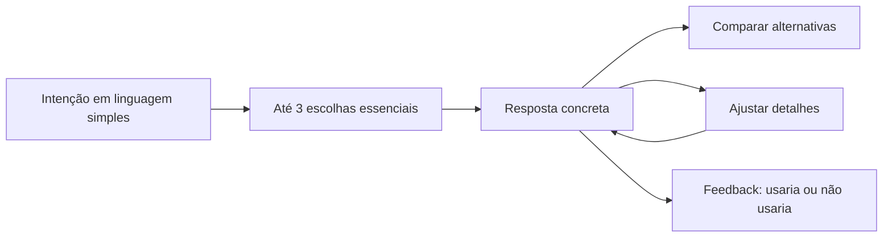

# Roadmap de revalidação do front-end

> Estado de partida: 17/08/2026. Esta rota começa depois da consolidação do Knowledge Core e do gate de demanda ODEUROPA. O objetivo é fazer o usuário chegar rapidamente a recomendações concretas, compreensíveis e rastreáveis, sem expor a complexidade interna do motor.

## 1. Diagnóstico atual

A interface possui acabamento visual forte e o ranking reage às alterações, mas a experiência ainda transfere para o usuário decisões técnicas demais:

- três etapas pedem temperatura, umidade, projeção, duração, faixa de preço, sensibilidade, acordes, notas e novidade antes de formar uma resposta narrativa;
- termos como acorde, projeção e faixa `1–5` pressupõem repertório de perfumaria;
- o painel de resultados compete visualmente com o formulário enquanto a consulta ainda está sendo preenchida;
- as três respostas aparecem como posições semelhantes, em vez de papéis claros como “melhor escolha”, “mais discreto” e “mais ousado”;
- o usuário recebe fatores e percentuais, mas não uma resposta curta dizendo qual perfume usar, por quê e qual é a principal ressalva.

Existe também um bloqueio de dados anterior ao layout. A baseline local com o cenário padrão — escritório interno, quente, cheio e sensível — retornou:

1. `Brisa Vetiver — Desconhecida`;
2. `Ameixa (Desodorante Colônia) — Desconhecida`;
3. `Coffee Man — Desconhecida`.

Duas opções vieram sem pirâmide e todas chegaram ao front-end sem marca resolvida. O catálogo contém exemplos reconhecíveis como `Aventus`, `Acqua Fiorentina` e `Bianco Latte`, e os documentos do Knowledge Core já registram marcas, mas essa identidade ainda não atravessa corretamente o compilador de recomendação.

O contrato `EligibleForRecommendation` valida estrutura computável. Ele ainda aceita placeholders como `Desconhecida`, listas olfativas vazias e estimativas padrão. Portanto:

```text
computável pelo motor ≠ pronto para ser mostrado ao usuário
```

## 2. Princípio da nova jornada

**Resposta primeiro; refinamento sob demanda.**

O usuário deve conseguir iniciar com linguagem cotidiana e obter uma recomendação útil em menos de um minuto. Controles técnicos permanecem disponíveis em “Ajustar detalhes”, sem bloquear o caminho principal.



## 3. Contrato de uma resposta concreta

Cada recomendação apresentada deve responder, nessa ordem:

1. **Qual:** nome comercial e marca resolvida.
2. **Por que agora:** uma frase ligada ao momento informado, sem repetir o score.
3. **Como cheira:** evolução olfativa curta, usando somente notas/acordes declarados e disponíveis.
4. **Como se comporta:** projeção e duração com rótulo de confiança; omitir precisão falsa.
5. **Ponto de atenção:** a principal incompatibilidade ou incerteza.
6. **Por que confiar:** natureza do dado — declarado, curadoria ou estimativa — e acesso à fonte.

Modelo de resposta:

> **Minha escolha para este momento: [Perfume] — [Marca].** Ele equilibra [preferência] com [restrição de ambiente]. Na abertura aparecem [notas declaradas]; depois, [coração/fundo declarado]. A presença tende a ser [nível], com confiança [nível]. Se você quiser algo [contraste útil], compare com [alternativa].

O texto deve ser montado deterministicamente. Gemini poderá melhorar a fluidez futuramente, mas não poderá acrescentar perfumes ou fatos fora dos candidatos recebidos.

## 4. Fases de implementação

### Fase 0 — baseline observável

- Criar cinco cenários ouro de uso: trabalho quente e cheio, encontro noturno, evento formal, lazer ao ar livre e preferência com nota proibida.
- Capturar para cada cenário: candidatos, exclusões, campos vazios, placeholders, forças, ressalvas e evidências.
- Medir quantos dos 249 registros atuais realmente possuem identidade e conteúdo suficientes para uma resposta humana.
- Salvar o relatório versionado sem registrar consultas pessoais.

**Aceite:** toda regressão futura consegue comparar qualidade da resposta, não apenas estabilidade do score.

### Fase 1 — gate `PresentationReady`

Criar uma camada posterior a `EligibleForRecommendation`, sem enfraquecer o contrato factual. Um perfume só pode aparecer na experiência principal quando:

- nome e marca estiverem resolvidos, sem placeholders;
- houver conteúdo olfativo declarado suficiente para explicar a escolha;
- concentração e identidade tiverem evidência rastreável;
- estimativas de desempenho estiverem identificadas como estimativas e com confiança;
- os motivos exibidos forem sustentados pelos campos realmente presentes;
- nenhum valor padrão for apresentado como observação específica do perfume.

Itens computáveis, mas incompletos, continuam disponíveis para auditoria e enriquecimento; não entram silenciosamente na vitrine.

**Aceite:** nenhuma resposta principal mostra “Desconhecida”, pirâmide vazia ou explicação baseada apenas em valores neutros.

### Fase 2 — simplificar a entrada

Substituir a sequência técnica por até três decisões essenciais:

1. **Para qual momento?** trabalho, encontro, festa, dia casual ou opção livre.
2. **Como quer ser percebido?** discreto, equilibrado ou marcante.
3. **Que referência combina com você?** perfumes conhecidos, sensações cotidianas ou “quero descobrir”.

Clima pode usar um resumo simples — frio, ameno ou quente — com temperatura/umidade em controles avançados. Acordes, notas proibidas, orçamento rígido e duração permanecem no refinamento opcional.

**Aceite:** um usuário sem vocabulário técnico conclui a consulta sem precisar entender “acorde”, “silagem” ou uma escala abstrata.

### Fase 3 — reorganizar os resultados

- Mostrar uma recomendação principal imediatamente.
- Dar funções distintas às alternativas: “mais discreta” e “mais ousada” ou “mais acessível”, conforme o conjunto disponível.
- Trocar o percentual dominante por justificativa e confiança; o score técnico pode ficar em detalhes.
- Exibir marca, concentração, notas presentes, ressalva e proveniência antes dos gráficos internos.
- Permitir “por que não outra opção?” usando as exclusões e trade-offs já calculados.
- Oferecer ações claras: `Usaria`, `Não combina comigo`, `Comparar` e `Ajustar consulta`.

**Aceite:** olhando apenas o primeiro cartão, o usuário consegue dizer qual perfume foi indicado e repetir o motivo da escolha.

### Fase 4 — exemplos reais e cenários de regressão

- Resolver a propagação de marca e identidade do Knowledge Core até o catálogo de recomendação.
- Auditar exemplos como Aventus, Acqua Fiorentina e Bianco Latte antes de usá-los em testes de interface.
- Não fixar esses perfumes como vencedores: o cenário ouro valida o formato e a coerência, enquanto o ranking permanece consequência dos dados aprovados.
- Adicionar testes de componente e ponta a ponta para consulta, filtros duros, ausência de resultado e comparação.

**Aceite:** cada cenário apresenta até três produtos reais, com marca e justificativa concreta, ou explica honestamente por que a base não possui uma opção segura.

### Fase 5 — validação com usuários

Executar primeiro uma rodada moderada com o proprietário e depois uma rodada curta com 5–8 pessoas que comprem ou usem perfumes, incluindo iniciantes.

Tarefas de teste:

- encontrar um perfume para trabalhar em um dia quente;
- evitar uma nota rejeitada;
- entender a diferença entre a primeira escolha e uma alternativa;
- localizar a origem e o nível de confiança da informação;
- ajustar a resposta sem reiniciar toda a consulta.

Métricas mínimas:

- pelo menos 80% concluem a primeira recomendação sem ajuda;
- mediana inferior a 60 segundos até uma resposta útil;
- pelo menos 80% identificam corretamente perfume, marca e motivo;
- zero recomendações com fatos ausentes apresentados como confirmados;
- registrar frases e pontos de hesitação, não apenas cliques.

### Fase 6 — demanda anônima e aprendizado

Somente depois de a jornada estar compreensível:

- apresentar consentimento simples e desativado por padrão para contribuir com demanda anônima;
- ligar o registrador ODEUROPA apenas às buscas/termos canônicos reconhecidos;
- nunca armazenar a frase bruta, IP, usuário, sessão ou dispositivo;
- manter feedback pessoal no dispositivo;
- usar demanda agregada para autorizar pesquisa, nunca como evidência factual.

**Aceite:** a experiência funciona integralmente sem telemetria; consentir não altera a recomendação recebida.

## 5. Ordem recomendada para a próxima sessão

1. Construir o auditor `PresentationReady` e medir a base atual.
2. Corrigir a propagação de marca e proveniência no compilador.
3. Definir o objeto `RecommendationAnswer`, separado do score interno.
4. Implementar o primeiro cenário ouro de resposta concreta.
5. Redesenhar somente então a consulta e os cartões.
6. Validar no navegador em desktop e celular.
7. Conduzir o teste moderado com o proprietário antes de instrumentar demanda.

## 6. Definição de pronto

A revalidação do front-end estará concluída quando:

- o fluxo essencial tiver no máximo três decisões antes da primeira resposta;
- nenhuma recomendação visível possuir identidade incompleta;
- a resposta principal trouxer perfume, marca, motivo, comportamento, ressalva e confiança;
- detalhes técnicos forem progressivos, não pré-requisitos;
- os cinco cenários ouro e os testes de interface passarem;
- a rodada com usuários atingir as métricas mínimas ou produzir uma nova iteração documentada;
- a coleta anônima permanecer opcional, privada e separada da evidência olfativa.
